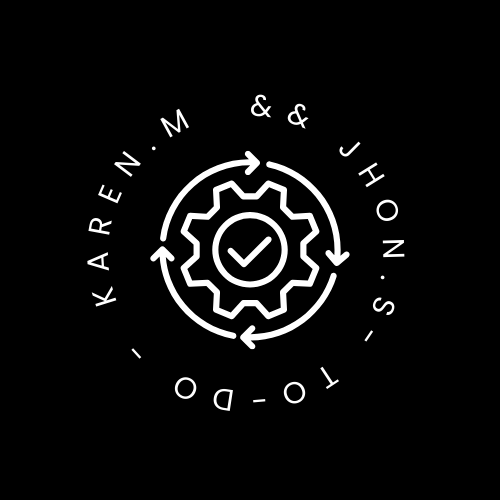

  

## TO-DO FRONT
TO-DO is a task management application that allows users to create, edit and delete tasks in a simple and intuitive way. The interface is designed to be clear and easy to use, optimized to provide a pleasant user experience.

### [FIGMA DESIGN](https://www.figma.com/proto/2Wp1nwfh88RhXSMC329LKN/Mockup-TO-DO?node-id=3-1084&t=R4SuMrMVgDqdImmf-1&scaling=contain&content-scaling=fixed&page-id=0%3A1) 

##  🛠️ Tools
### Frontend Frameworks
* [![React][React-logo]][React-url] - React is a JavaScript library for building user interfaces. 
* [![TypeScript][TypeScript-logo]][TypeScript-url] - TypeScript is a typed superset of JavaScript that compiles to standard JavaScript. It provides optional static types to detect compile-time errors.
* [![CSS3][CSS3-logo]][CSS3-url] - Css3 Defines the design and visual appearance of the web application, ensuring a consistent and attractive user experience.

### Libraries & Tools
* [![Redux Toolkit][ReduxToolkit-logo]][ReduxToolkit-url] - Redux Toolkit is the official and recommended library for working with Redux, simplifying global state management in React applications.
* [![Axios][Axios-logo]][Axios-url] - Axios is a popular library for making HTTP requests from the browser or Node.js. 
* [![Context][Context-logo]][Context-url] - Context API is a React feature that allows you to pass data through the component tree without the need to manually pass props to each level.
* [![Zustand][Zustand-logo]][Zustand-url] -  Zustand is a small hook-based state management library for React. It provides a simple and effective API for managing the local state of components.
* [![Redux][Redux-logo]][Redux-url] - Redux is a predictable state management library for JavaScript applications, with a single truth source for the state of the entire application.

# Contact
### <svg xmlns="http://www.w3.org/2000/svg" height="24px" viewBox="0 -960 960 960" width="24px" fill="#5f6368"><path d="M160-160q-33 0-56.5-23.5T80-240v-480q0-33 23.5-56.5T160-800h640q33 0 56.5 23.5T880-720v480q0 33-23.5 56.5T800-160H160Zm320-280L160-640v400h640v-400L480-440Zm0-80 320-200H160l320 200ZM160-640v-80 480-400Z"/></svg> Jhon Sierra - sierrazuluaga.j@gmail.com
### <svg xmlns="http://www.w3.org/2000/svg" height="24px" viewBox="0 -960 960 960" width="24px" fill="#5f6368"><path d="M160-160q-33 0-56.5-23.5T80-240v-480q0-33 23.5-56.5T160-800h640q33 0 56.5 23.5T880-720v480q0 33-23.5 56.5T800-160H160Zm320-280L160-640v400h640v-400L480-440Zm0-80 320-200H160l320 200ZM160-640v-80 480-400Z"/></svg> Karen Moreno - naghellymoreno0610@gmail.com

[React-logo]: https://img.shields.io/badge/React-20232A?style=for-the-badge&logo=react&logoColor=61DAFB
[React-url]: https://reactjs.org/
[TypeScript-logo]: https://img.shields.io/badge/TypeScript-007ACC?style=for-the-badge&logo=typescript&logoColor=white
[TypeScript-url]: https://www.typescriptlang.org/
[CSS3-logo]: https://img.shields.io/badge/CSS3-1572B6?style=for-the-badge&logo=css3&logoColor=white
[CSS3-url]: https://developer.mozilla.org/en-US/docs/Web/CSS
[ReduxToolkit-logo]: https://img.shields.io/badge/Redux%20Toolkit-764ABC?style=for-the-badge&logo=redux&logoColor=white
[ReduxToolkit-url]: https://redux-toolkit.js.org/
[Axios-logo]: https://img.shields.io/badge/Axios-5A29E4?style=for-the-badge&logo=axios&logoColor=white
[Axios-url]: https://axios-http.com/
[Context-logo]: https://img.shields.io/badge/Context-007ACC?style=for-the-badge&logo=react&logoColor=white
[Context-url]: https://reactjs.org/docs/context.html
[Zustand-logo]: https://img.shields.io/badge/Zustand-FF6347?style=for-the-badge&logo=redux&logoColor=white
[Zustand-url]: https://zustand.surge.sh/
[Redux-logo]: https://img.shields.io/badge/Redux-764ABC?style=for-the-badge&logo=redux&logoColor=white
[Redux-url]: https://redux.js.org/  